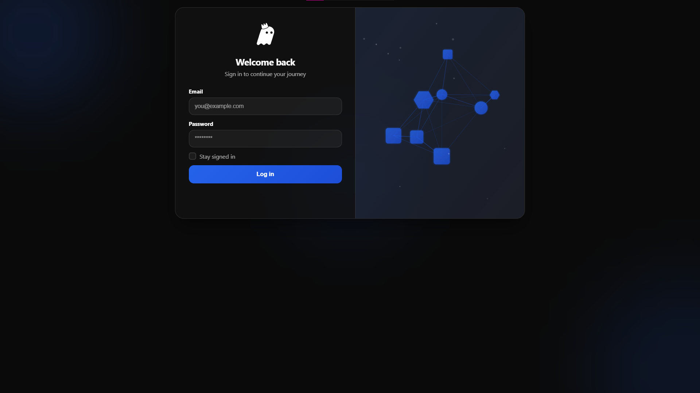
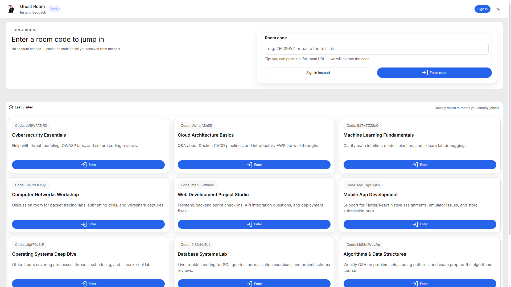
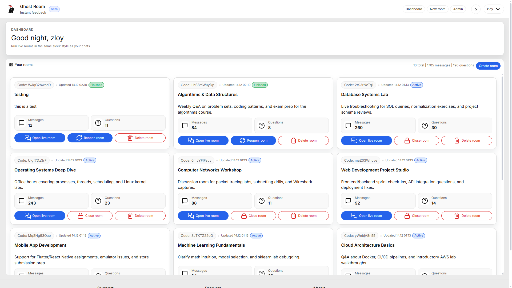
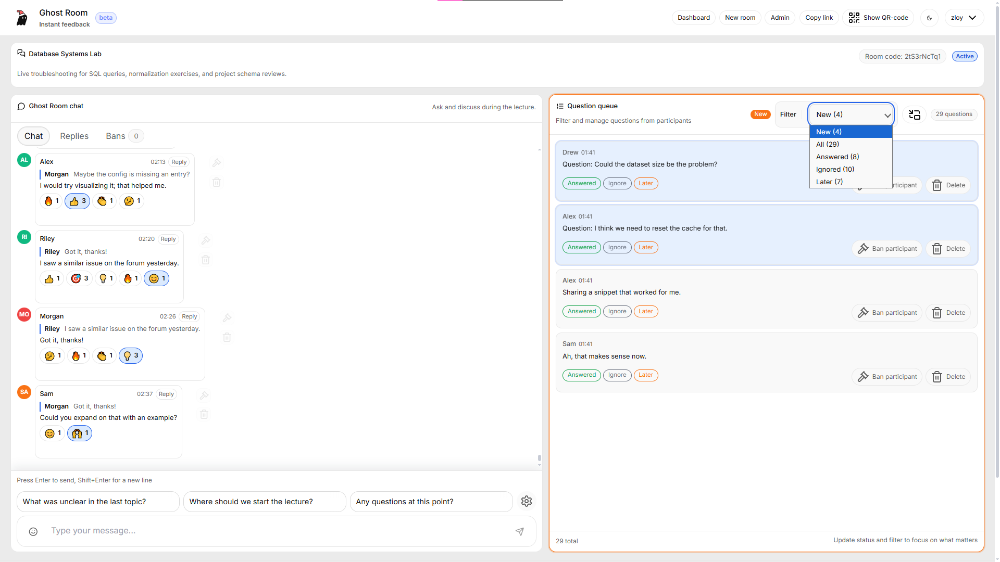
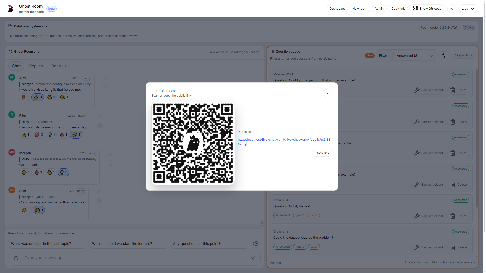
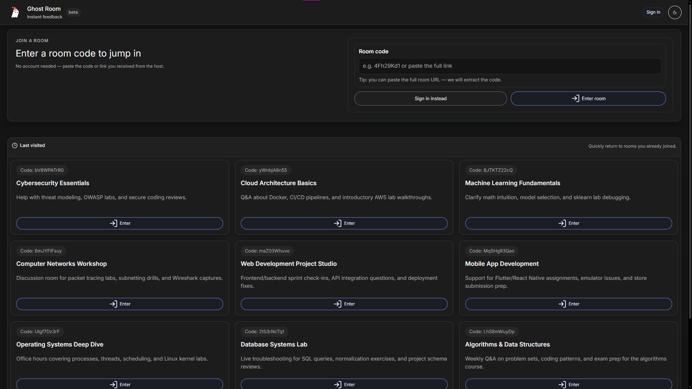
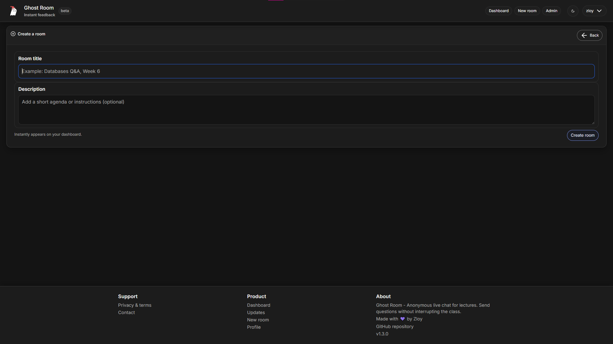
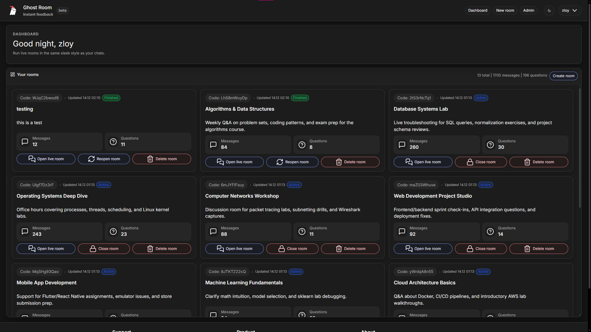
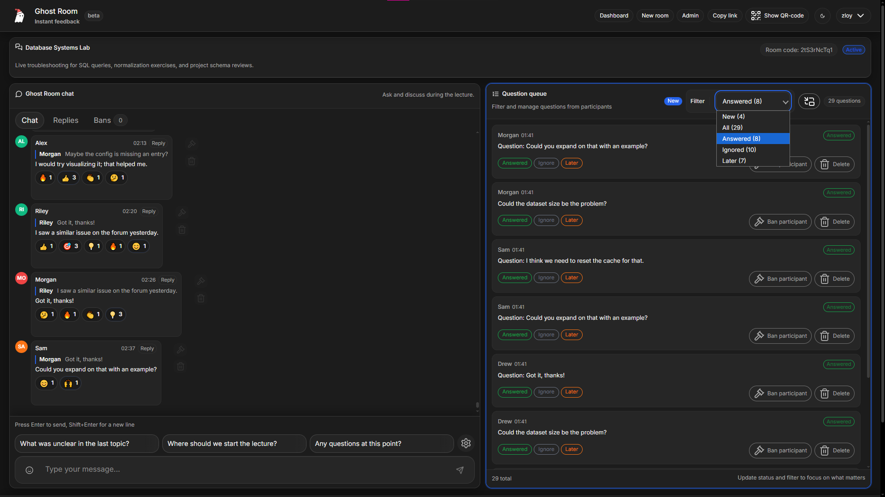
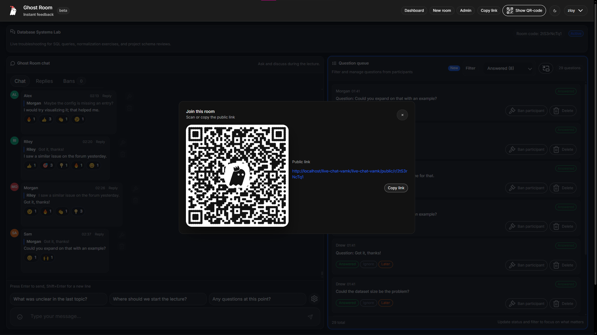

<p align="center">
  
</p>

# Ghost Room

**Anonymous Q&A rooms for lectures and live sessions**

Ghost Room is a web application for university lectures, seminars, and live events that lets students ask questions anonymously while giving lecturers a structured way to manage them.

---

## Demo / Production

- Production: https://ghostroom.fi
- Repository: https://github.com/KristopherZlo/live-chat-vamk
  *(source code is publicly visible, but the license is not open-source)*

---

## Project status

**BETA**

---

## Screenshots

### Light theme

| Login | Join | Create |
| --- | --- | --- |
|  |  |  |

| Dashboard | Room | QR code |
| --- | --- | --- |
|  |  |  |

### Dark theme

| Join | Create | Dashboard |
| --- | --- | --- |
|  |  |  |

| Room | QR code |
| --- | --- |
|  |  |

---

## How it works (high level)

1. **Host (lecturer)** creates a room and shares a public link or QR code.
2. **Participants (students)** join the room and post chat messages or mark messages as questions.
3. Questions appear in a **private queue** visible only to the host.
4. The host reviews questions, changes their status, and responds when appropriate.

---

## Features

### Host (lecturer)

* Private question queue with statuses: `new`, `answered`, `ignored`, `later`
* Sound notification on new questions
* Picture-in-Picture question queue
* Moderation tools (remove questions, ban participants)

### Participant (student)

* Anonymous participation (chat + questions)
* Reactions and threaded replies
* Personal "My Questions" panel
* Delete own questions and rate answers

### Real-time + scale

* Live updates via WebSockets (polling fallback if unavailable)
* Optimistic UI updates for smooth interaction
* Designed for academic audiences (~150–250 participants); messages/questions are loaded in chunks
* Browser-only usage (no mobile apps required)

---

## Security & access control

* Invite-only registration
* CSRF / XSRF protection
* Throttling for registration, login, and messaging
* Ban enforcement using IP and fingerprint
* Strict permission checks for all moderation actions

---

## Tech stack

### Backend

* Laravel 12
* Blade templates
* REST APIs + Events
* Laravel Echo (WebSockets)

### Frontend

* Vite
* Tailwind CSS
* Vanilla JavaScript + TypeScript
* PostCSS

### Storage & infrastructure

* MySQL / MariaDB
* Redis (optional)
* Queue workers
* Cookies and sessions

---

## Server requirements

* PHP 8.2+ with extensions:
  * `pdo_mysql` / `pdo_pgsql`
  * `mbstring`
  * `openssl`
  * `json`
  * `ctype`
  * `fileinfo`
* Composer 2.x
* Node.js 18+ and npm
* MariaDB / MySQL 10.5+ (or compatible)
* Redis (optional — DB is used by default for cache, sessions, and queues)

---

## Quick start (local)

```bash
git clone https://github.com/KristopherZlo/live-chat-vamk.git
cd live-chat-vamk

cp .env.example .env
composer install
npm install

php artisan key:generate
# create database and set DB_* variables in .env
php artisan migrate

php artisan serve    # http://localhost:8000
npm run dev          # assets + HMR
```

If using queues (`QUEUE_CONNECTION=database`), run a worker in another terminal:

```bash
php artisan queue:work
```

---

## Build and deploy to your server

```bash
git clone https://github.com/KristopherZlo/live-chat-vamk.git
cd live-chat-vamk

cp .env.example .env
# set APP_ENV=production
# set APP_DEBUG=false
# set APP_URL=https://your-domain
# configure database credentials

composer install --no-dev --optimize-autoloader
php artisan key:generate
php artisan migrate --force

npm install
npm run build
```

Deployment notes:

* Ensure `storage/` and `bootstrap/cache/` are writable by the web server.
* Point the web server document root to `public/`.
* Keep `php artisan queue:work` running under supervisor or systemd if queues are used.

---

## Useful commands

* Run tests: `php artisan test`
* Clear config cache: `php artisan config:clear`
* Rebuild frontend assets: `npm run build`

### Dev / test only

* Seed a room with demo chat data (messages, replies, questions, reactions):
  `php artisan chat:seed-demo <room-id-or-slug> [--count=200] [--delay=0]`
  `php artisan chat:seed-questions <room-id-or-slug> [--count=50]`
  `php artisan chat:seed-messages <room-id-or-slug> [--count=200]`
  `php artisan chat:seed-poll <room-id-or-slug> [--options=] [--votes=] [--replies=] [--reactions=] [--participants=]`
* Stream continuous demo activity (messages, replies, questions, reactions, poll votes):
  `php artisan chat:stream-demo <room-id-or-slug> [--delay=1-3] [--participants=8]`
* Simulate a live question stream (with a delay between questions):
  `php artisan chat:seed-questions <room-id-or-slug> [--count=50] [--delay=1]`
* Generate invite codes for registration:
  `php artisan invite:generate {count=1} [--length=12]`

---

## TODO

* [x] Polls and live voting
* [ ] Further loading and performance optimizations
* [ ] Interactive onboarding tutorial for hosts and students
* [ ] Email verification

---

## License

The source code is publicly available for review and learning purposes.
The project is **not open-source**, and reuse or redistribution is restricted.

---

## Author

Created and maintained by **KristopherZlo**.
Originally developed for university use.
